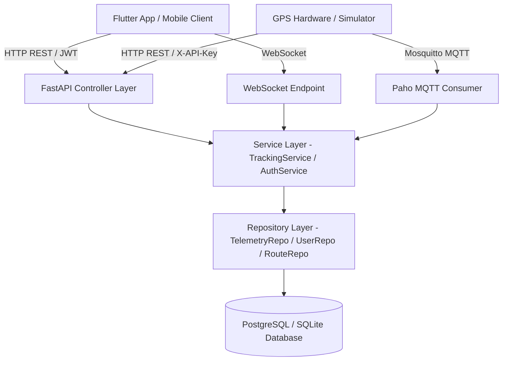
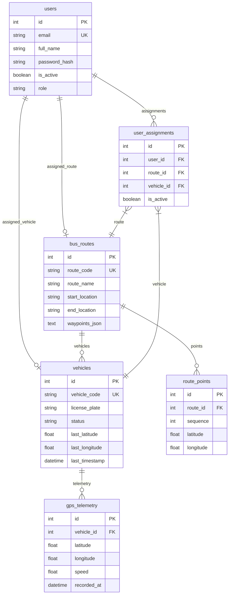
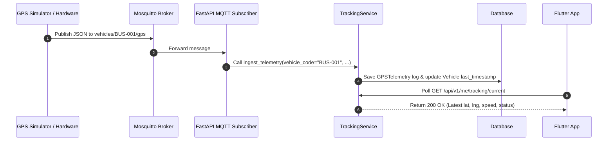

# Vehicle Tracking Backend

Production-grade, asynchronous Python FastAPI backend for real-time GPS vehicle tracking, multi-tenant user access isolation, Mosquitto MQTT telemetry ingestion, and route management.

---

## Table of Contents
- [Overview](#overview)
- [Assessment Requirements](#assessment-requirements)
- [Architecture](#architecture)
- [Technology Stack](#technology-stack)
- [Folder Structure](#folder-structure)
- [Database Design & Entity Relationships](#database-design--entity-relationships)
- [Authentication](#authentication)
- [Authorization & Business Rule Enforcement](#authorization--business-rule-enforcement)
- [User, Route, and Vehicle Assignment](#user-route-and-vehicle-assignment)
- [GPS Data Model](#gps-data-model)
- [MQTT Architecture & Ingestion](#mqtt-architecture--ingestion)
- [GPS Data Flow](#gps-data-flow)
- [API Endpoints Reference](#api-endpoints-reference)
- [Environment Variables](#environment-variables)
- [Local Setup & Installation](#local-setup--installation)
- [Docker Setup](#docker-setup)
- [Database Migrations](#database-migrations)
- [Seed Data Development Script](#seed-data-development-script)
- [Standalone GPS Simulator](#standalone-gps-simulator)
- [Automated Testing Suite](#automated-testing-suite)
- [OpenAPI & Swagger Documentation](#openapi--swagger-documentation)
- [Security Considerations](#security-considerations)
- [Flutter Integration Flow](#flutter-integration-flow)
- [Future Improvements](#future-improvements)

---

## Overview
The **Vehicle Tracking Backend** is a high-performance REST and MQTT application designed to track live public transit vehicles (e.g., city buses) along predefined routes. It provides strict security controls to ensure authenticated users can only monitor their assigned vehicles and routes.

Key Capabilities:
- **Dual Telemetry Ingestion**: Supports high-throughput REST HTTP ingestion (`POST /api/v1/gps`) and Mosquitto MQTT telemetry subscriptions (`vehicles/+/gps`).
- **Multi-Tenant Access Isolation**: Guarantees regular users cannot view or access unassigned routes, vehicles, current coordinates, or location history.
- **Dynamic Vehicle Status Calculation**: Dynamically computes vehicle status (`ONLINE`, `STALE`, `OFFLINE`, `NO_DATA`) based on configurable timestamp thresholds.
- **Comprehensive API Suite**: Out-of-the-box endpoints for user profile management, tracking summaries, history filtering, and real-time polling/WebSocket streaming.

---

## Assessment Requirements
This repository fulfills all assessment criteria:
1. **Separation of Architecture Layers**: Clean 4-tier separation (`Controller` → `Service` → `Repository` → `Database`). Controllers contain zero SQL queries or business logic.
2. **Strict Backend Authorization**: Client-provided IDs (`vehicle_id`, `route_id`) are never trusted. All access checks are enforced by backend assignment lookup.
3. **Idempotent Seed Script**: Script seeds User A, User B, Admin, Route A, Route B, BUS-001, and BUS-002 without creating duplicate records on consecutive runs.
4. **Standalone GPS Simulator**: Python script simulating vehicle movement over MQTT with realistic speed and coordinates.
5. **Cross-User Security Proof Tests**: Automated `pytest` suite verifying access isolation and HTTP 403 responses.
6. **Centralized Exception Handling & Scrubbed Logging**: Standardized API error payloads that hide SQL queries, stack traces, and sensitive credentials in production.

---

## Architecture



---

## Technology Stack
- **Language**: Python 3.12+
- **Web Framework**: FastAPI (Async ASGI framework)
- **ORM & Database**: SQLAlchemy 2.0 (Declarative Mapped Types) with PostgreSQL 16 / SQLite support
- **Migrations**: Alembic
- **Validation & Schemas**: Pydantic V2
- **Authentication**: OAuth2 Bearer with JWT (PyJWT) and Passlib / Bcrypt password hashing
- **Messaging Broker**: Eclipse Mosquitto MQTT (Authenticating consumer via Paho-MQTT)
- **Containerization**: Docker & Docker Compose
- **Testing**: Pytest & HTTPX Async Client

---

## Folder Structure

```
vehicle-tracking-backend/
├── alembic/                      # Database migration scripts
│   └── versions/
├── app/
│   ├── api/                      # API Layer
│   │   ├── dependencies.py       # Reusable FastAPI auth & permission dependencies
│   │   └── v1/
│   │       ├── router.py         # Primary API v1 router definition
│   │       └── endpoints/        # Refactored thin controllers
│   │           ├── auth.py
│   │           ├── me.py
│   │           ├── routes.py
│   │           ├── telemetry.py
│   │           ├── users.py
│   │           ├── vehicles.py
│   │           └── ws_tracking.py # Optional real-time WebSocket bonus
│   ├── core/                     # Application core configuration
│   │   ├── config.py             # Pydantic BaseSettings environment config
│   │   ├── logging_config.py     # Production logging setup with sensitive data filter
│   │   ├── middleware.py         # Security headers & payload size limit middleware
│   │   └── security.py          # Password hashing & JWT generation utilities
│   ├── db/                       # Database session & engine initialization
│   ├── exceptions/               # Centralized exception handlers & custom errors
│   ├── models/                   # SQLAlchemy ORM models
│   ├── mqtt/                     # Mosquitto MQTT client subscriber
│   ├── repositories/             # Data access repository layer
│   ├── schemas/                  # Pydantic request/response schemas
│   ├── services/                 # Domain business logic services
│   └── utils/                    # Helper functions & JSON parsing utilities
├── mosquitto/                    # Mosquitto broker configuration & secrets
├── scripts/                      # DB initialization & seeding scripts
├── simulator/                    # Standalone Python GPS Simulator
├── tests/                        # Automated Pytest suite
├── docker-compose.yml
├── Dockerfile
├── requirements.txt
└── README.md
```

---

## Database Design & Entity Relationships



---

## Authentication
Authentication is implemented via standard **OAuth2 Bearer JWT Tokens**:
1. Clients issue a request to `POST /api/v1/auth/login` with valid credentials.
2. The server verifies the email and bcrypt password hash.
3. Upon success, a signed JWT access token is returned containing the user ID in the `sub` claim.
4. Clients attach `Authorization: Bearer <token>` on all protected endpoints.

---

## Authorization & Business Rule Enforcement

### The Critical Business Rule
The system enforces strict multi-tenant access boundaries:

$$\text{User A} \longrightarrow \text{Route A} \longrightarrow \mathbf{BUS-001}$$
$$\text{User B} \longrightarrow \text{Route B} \longrightarrow \mathbf{BUS-002}$$

### Backend Authorization Guarantee
- Client requests **NEVER** dictate which vehicle or route data is returned.
- When User A calls `GET /api/v1/me/tracking`, the backend queries `AssignmentService` to locate User A's active assignment, returning data **ONLY** for Route A and BUS-001.
- If User A attempts to access `/api/v1/vehicles/2` (BUS-002) or `/api/v1/vehicles/2/location/history`, the backend rejects the request immediately with **HTTP 403 Forbidden**.

---

## User, Route, and Vehicle Assignment
- Assignments are represented by the `UserAssignment` entity with `is_active = True`.
- `AssignmentService` acts as the single source of truth across the backend for resolving active routes and vehicles.
- Admins possess system-wide permissions to inspect all vehicles and routes.

---

## GPS Data Model
Telemetry records are stored in `gps_telemetry`:
- `vehicle_id`: Foreign key referencing the vehicle.
- `latitude` / `longitude`: Validated floating point coordinates (-90 to +90, -180 to +180).
- `speed`: Vehicle speed in km/h ($\ge 0.0$).
- `recorded_at`: Timestamp recorded by the device (ISO 8601 UTC).
- `source`: Telemetry ingestion medium (`REST` or `MQTT`).

---

## MQTT Architecture & Ingestion
- **Broker**: Eclipse Mosquitto 2.0 with authentication enabled (`allow_anonymous false`).
- **Topic Pattern**: `vehicles/{vehicle_code}/gps`
- **Subscriber**: Built-in background Python thread in `app/mqtt/client.py` using `paho-mqtt`.
- **Single Processing Pipeline**: Both REST and MQTT messages call the exact same core service method: `TrackingService.ingest_telemetry()`.

---

## GPS Data Flow



---

## API Endpoints Reference

| Tag | Method | Endpoint | Description | Auth Required |
| :--- | :--- | :--- | :--- | :--- |
| **Authentication** | `POST` | `/api/v1/auth/login` | Authenticate email/password & return JWT token | None |
| **Users** | `GET` | `/api/v1/users/me` | Return profile of authenticated user | Bearer Token |
| **Tracking** | `GET` | `/api/v1/me/route` | Return assigned route for authenticated user | Bearer Token |
| **Tracking** | `GET` | `/api/v1/me/vehicle` | Return assigned vehicle for authenticated user | Bearer Token |
| **Tracking** | `GET` | `/api/v1/me/tracking` | Return unified summary (route, vehicle, latest GPS, status) | Bearer Token |
| **Tracking** | `GET` | `/api/v1/me/tracking/current` | Lightweight current location & dynamic status for polling | Bearer Token |
| **Tracking** | `GET` | `/api/v1/me/tracking/history` | Historical GPS telemetry with date filtering (`from`, `to`, `limit`) | Bearer Token |
| **GPS** | `POST` | `/api/v1/gps` | REST GPS Telemetry Ingestion endpoint | X-API-Key / Bearer |
| **Health** | `GET` | `/health` | System operational health check | None |

---

## Environment Variables

Copy `.env.example` to `.env` to configure application options:

| Variable | Default Value | Description |
| :--- | :--- | :--- |
| `APP_ENV` | `development` | Application environment (`development` / `production`) |
| `SECRET_KEY` | `super-secret-key-change-in-production` | Secret key used for signing JWT tokens |
| `ACCESS_TOKEN_EXPIRE_MINUTES` | `30` | JWT token expiration time in minutes |
| `DATABASE_URL` | `sqlite:///./vehicle_tracking.db` | SQLAlchemy database connection string |
| `MQTT_ENABLED` | `True` | Enable/disable MQTT background consumer |
| `MQTT_HOST` | `localhost` | Mosquitto MQTT broker hostname |
| `MQTT_PORT` | `1883` | Mosquitto MQTT broker port |
| `MQTT_USERNAME` | `vehicle_tracker` | MQTT subscriber username |
| `MQTT_PASSWORD` | `mqtt_secure_password_123` | MQTT subscriber password |
| `GPS_ONLINE_THRESHOLD_SECONDS` | `30` | Seconds threshold for `ONLINE` vehicle status |
| `GPS_STALE_THRESHOLD_SECONDS` | `180` | Seconds threshold for `STALE` vehicle status |

---

## Local Setup & Installation

### 1. Prerequisites
- Python 3.12+
- Virtual environment tool (`venv`)

### 2. Setup Virtual Environment & Install Dependencies
```bash
python -m venv venv
# Windows:
venv\Scripts\activate
# Linux/macOS:
source venv/bin/activate

pip install -r requirements.txt
```

### 3. Initialize Database & Seed Development Data
```bash
python scripts/seed_db.py
```

### 4. Run Application Backend Server
```bash
uvicorn app.main:app --reload --port 8000
```
API Documentation will be accessible at: `http://localhost:8000/api/v1/docs`

---

## Docker Setup

Run the entire backend stack (FastAPI, PostgreSQL 16, Mosquitto MQTT) with Docker Compose:

```bash
docker-compose up --build
```

Services started:
- `db`: PostgreSQL 16 database running on port `5432`
- `mqtt_broker`: Mosquitto MQTT broker running on port `1883`
- `web`: FastAPI backend application running on port `8000`

---

## Database Migrations
Database schema migrations are managed via Alembic:

```bash
# Create a new migration revision after model changes
alembic revision --autogenerate -m "Add new indexes"

# Apply migrations to database
alembic upgrade head
```

---

## Seed Data Development Script
An idempotent seeding script is provided to set up development accounts:

```bash
python scripts/seed_db.py
```

### Development Credentials

| Role | Email | Password | Assigned Route | Assigned Vehicle |
| :--- | :--- | :--- | :--- | :--- |
| **User A** | `usera@example.com` | `UserA@123` | Route A (`ROUTE-101`) | BUS-001 |
| **User B** | `userb@example.com` | `UserB@123` | Route B (`ROUTE-202`) | BUS-002 |
| **Admin** | `admin@example.com` | `Admin@123` | All Routes (Admin) | All Vehicles (Admin) |

---

## Standalone GPS Simulator
To test live tracking without physical GPS hardware, execute the standalone Python GPS simulator:

```bash
python simulator/gps_simulator.py
```

Features:
- Connects to Mosquitto MQTT with authentication credentials.
- Simulates BUS-001 moving along predefined stop coordinates.
- Publishes coordinates every 3 seconds to `vehicles/BUS-001/gps`.
- Automatically falls back to REST API ingestion (`POST /api/v1/gps`) if the MQTT broker is offline.

---

## Automated Testing Suite
Run the test suite using Pytest:

```bash
pytest -v
```

Key Test Suites:
- `tests/test_cross_user_security_proof.py`: Verifies strict cross-user authorization boundaries and 403 Forbidden responses.
- `tests/test_authentication_suite.py`: Tests valid login, incorrect password, expired JWTs, missing headers, and inactive accounts.

---

## OpenAPI & Swagger Documentation
Interactive API documentation is generated automatically by FastAPI:
- **Swagger UI**: `http://localhost:8000/api/v1/docs`
- **ReDoc**: `http://localhost:8000/api/v1/redoc`

Swagger UI supports direct JWT Bearer authentication testing via the **Authorize** button.

---

## Security Considerations
- **No Sensitive Leaks**: Centralized exception handlers strip SQL error tracebacks and database credentials from API responses.
- **Scrubbed Production Logs**: `SensitiveDataFilter` automatically redacts passwords, JWT tokens, and API keys from stdout/file logs.
- **Request Size Middleware**: Enforces a 2MB maximum payload limit to mitigate denial-of-service (DoS) attacks.
- **Security Headers**: Injects `X-Content-Type-Options: nosniff`, `X-Frame-Options: DENY`, and `X-XSS-Protection` headers into HTTP responses.

---

## Flutter Integration Flow
1. **Login**: Flutter calls `POST /api/v1/auth/login` and stores `access_token` in `flutter_secure_storage`.
2. **Fetch Tracking Details**: App calls `GET /api/v1/me/tracking` to retrieve assigned route waypoints and current vehicle status.
3. **Render UI**: Render polyline overlay for route waypoints and place the bus marker at the current coordinates.
4. **Live Polling**: Poll `GET /api/v1/me/tracking/current` every 5 seconds to update vehicle position and speed smoothly on screen.

---

## Future Improvements
- **Geofencing & Route Deviation Alerts**: Add spatial checks to detect when a bus strays off its assigned route polyline.
- **Historical Playback UI**: Add endpoint supporting time-series animation data for route replay over custom date ranges.
- **Production Redis Caching**: Cache latest vehicle locations in Redis to serve high-frequency polling requests with zero database overhead.
